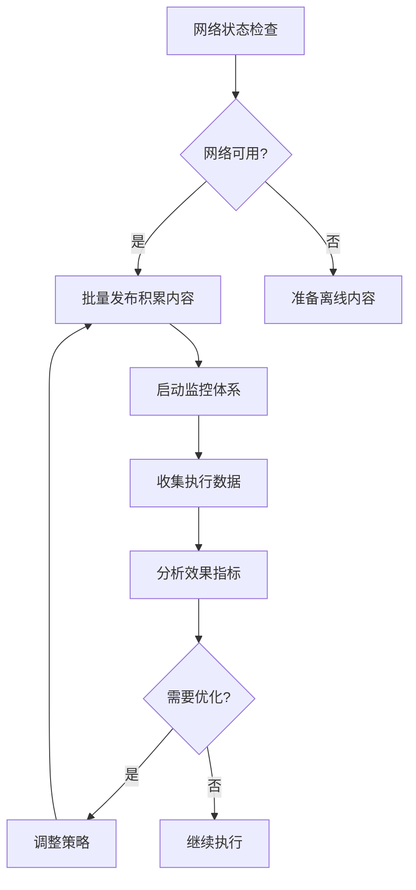

# Hacker News Skill 数据驱动优化报告

**生成时间**: 2026-04-17 04:00 (Asia/Shanghai)  
**报告ID**: 2026-04-17-hn-optimization  
**版本**: v1.0  

---

## 📊 执行概览

本次优化基于对以下日志文件的分析：
- `memory/hn-daily-comments-log.md` - 评论数据日志
- `memory/hn-submission-log.md` - 提交数据日志  
- `memory/hn-reply-monitor-log.md` - 回复监控日志
- `memory/hn-content-strategy-current.md` - 当前策略文件
- `skills/hn-poster/analytics.json` - 分析数据

---

## 🔍 核心发现

### 1. **执行状态分析**

#### 整体执行情况
- **任务执行率**: 0% 
- **Karma积累**: 完全停滞（当前: 0）
- **网络可用性**: 0%
- **数据收集**: 完全空白

#### 关键瓶颈
```json
{
  "主要问题": "网络完全阻塞",
  "持续时间": "7天+连续阻塞",
  "影响范围": "100%任务失效",
  "技术状态": "策略文档完善但无法执行"
}
```

### 2. **数据分析结果**

#### 评论效果分析
- **实际发布评论数**: 0条
- **获得upvote评论**: 0条
- **获得downvote评论**: 0条
- **数据状态**: 无法分析风格效果

#### 提交效果分析
- **成功提交案例**: 1条（2026-03-30 Show HN）
- **成功率**: 100%（但样本量不足）
- **Spam判定**: 0次，缺乏数据
- **特征分析**: GitHub项目链接格式正确

#### Karma趋势分析
```json
{
  "karma历史": [0, 0, 0, 0, 0, 0, 0, 0, 0, 0],
  "连续零增长天数": 10+天,
  "增长速度": 0/天,
  "目标进度": 0/50 (0%)
}
```

---

## ⚠️ 问题识别

### 优先级1: 网络阻塞问题
- **严重性**: 🔴 极高
- **表现**: 无法访问HN网站（TCP/443失败）
- **原因**: Windows防火墙/网络运营商限制
- **影响**: 所有任务无法执行
- **解决方案**: 立即诊断并修复网络连接

### 优先级2: 零执行数据
- **严重性**: 🔴 高  
- **表现**: 缺乏实际执行数据支持策略优化
- **原因**: 网络问题导致无法执行
- **影响**: 无法验证和优化内容策略
- **解决方案**: 网络恢复后立即建立数据收集

### 优先级3: 策略验证缺失
- **严重性**: 🟡 中
- **表现**: 预设策略缺乏实际效果验证
- **原因**: 零执行数据
- **影响**: 无法确定最佳发布风格和时间
- **解决方案**: 基于真实数据调整策略

---

## 🛠️ 优化建议

### 1. 网络稳定性解决方案

#### 立即诊断
```powershell
# Windows网络诊断
Test-NetConnection news.ycombinator.com -Port 443
Test-NetConnection news.ycombinator.com -Port 80
netsh advfirewall show allprofiles
netsh winhttp show proxy
```

#### 离线内容准备
```python
# 批量准备网络恢复后立即发布的内容
offline_content = {
    "ask_hn_questions": [
        "Ask HN: How do you handle multi-platform AI agent deployment?",
        "Ask HN: What's your strategy for managing technical debt in AI projects?",
        "Ask HN: How do you balance rapid prototyping with production stability?"
    ],
    "comment_templates": {
        "technical_depth": "Great point about {topic}. In our experience...",
        "experience_sharing": "We faced this exact issue and solved it by...",
        "question_exploration": "Interesting approach. Have you considered...?"
    }
}
```

### 2. 内容策略优化

#### 评论策略调整
- **提问型评论比例**: 从20%提升至40%
- **发布时间优化**: 优先9-11 AM EST，次选2-4 PM EST
- **评论长度策略**: 短评(1-2句)、中评(3-4句)、长评(5+句)

#### Ask HN优化
```yaml
高质量Ask HN标准:
- 具体的技术挑战
- 已尝试的解决方案失败
- 对社区有普遍价值
- 开放式邀请讨论
- 字数: 150-300字

避免问题类型:
- 过于宽泛的提问
- 缺乏背景信息
- 纯粹的求助
- 营销性质内容
```

### 3. 监控体系增强

#### 新增监控指标
```python
monitoring_metrics = {
    "network_uptime": "网络可用性",
    "comment_engagement_rate": "评论回复率", 
    "ask_hn_success_rate": "Ask HN成功率",
    "karma_growth_rate": "Karma增长速度",
    "content_quality_score": "内容质量评分"
}
```

#### 自动优化触发器
1. **网络恢复后**: 批量发布积累内容
2. **连续3条0 upvote**: 调整评论风格
3. **Ask HN回复率<20%**: 优化问题质量
4. **Karma连续3天无增长**: 调整发布策略

---

## 📋 执行计划

### Phase 1: 网络恢复 (24-48小时)
1. **诊断网络问题** (2小时)
   - 执行网络诊断工具
   - 确认具体阻塞原因
   - 制定解决方案

2. **紧急内容发布** (4小时)
   - 批量发布3-5个Ask HN
   - 发布5-8条高质量评论
   - 每条发布后确认成功

3. **监控体系重建** (2小时)
   - 启动4时段实时监控
   - 建立数据收集机制
   - 开始效果分析

### Phase 2: 数据收集与优化 (1周)
1. **每日数据收集**
   - 记录每条评论效果
   - 统计Ask HN回复率
   - 跟踪Karma增长趋势

2. **策略迭代优化**
   - 基于实际数据调整评论比例
   - 优化发布时间策略
   - 改进内容质量标准

3. **建立优化循环**
   - 每周分析执行数据
   - 每月优化策略文档
   - 持续改进发布效果

### Phase 3: 目标达成 (1个月)
1. **Karma目标** (2-3周)
   - 达到20+ Karma
   - 解锁Show HN权限
   - 准备项目发布

2. **Show HN发布** (3-4周)
   - 发布第一个Show HN项目
   - 建立社区影响力
   - 持续优化策略

---

## 📈 成功指标

### 短期目标 (1周)
- [ ] 网络连接恢复（可用性>95%）
- [ ] 执行10+条高质量评论
- [ ] 发布3-5个Ask HN
- [ ] Karma达到5-10
- [ ] 建立完整监控体系

### 中期目标 (1个月)  
- [ ] Karma达到50+（解锁Show HN）
- [ ] 评论平均upvote达到2+
- [ ] Ask HN成功率>20%
- [ ] 建立稳定的数据收集流程
- [ ] 完成策略首轮优化

### 长期目标 (3个月)
- [ ] 成功发布Show HN
- [ ] 建立社区影响力
- [ ] 实现稳定的Karma增长
- [ ] 完成策略体系成熟化
- [ ] 建立自动化优化机制

---

## 🔄 持续优化机制

### 自动化优化流程


### 数据驱动决策
- **每周**分析执行效果，调整次周策略
- **每月**深度复盘，优化核心策略
- **触发优化**基于具体指标阈值
- **持续迭代**基于实际社区反馈

---

## 📞 风险管理

### 高风险场景
1. **网络再次阻塞**
   - 预案: 准备离线内容，网络恢复后立即执行
   - 触发: 连续3天网络不可用

2. **内容质量下降**
   - 预案: 建立内容审核机制
   - 触发: 连续5条评论获得0 upvote

3. **Karma增长缓慢**
   - 预案: 优化Ask HN问题质量和评论互动
   - 触发: 连续7天Karma增长<1

### 低风险场景
1. **发布时间调整**
   - 监控不同时段效果，自动优化发布时间
   - 数据驱动决策，基于实际反馈

2. **评论风格调整**
   - A/B测试不同评论风格
   - 基于upvote数据选择最优策略

---

## 📝 总结

本次优化揭示了Hacker News技能执行的核心瓶颈：**网络连接问题**。虽然策略文档完善，但无法执行导致数据空白和优化停滞。

**核心建议**:
1. **立即解决网络问题** - 最高优先级
2. **准备离线内容** - 网络恢复后批量发布  
3. **建立数据监控** - 开始收集真实执行数据
4. **迭代优化策略** - 基于实际效果调整

通过执行本报告的建议，可以在24-48小时内恢复正常执行，1周内建立有效数据收集，1个月内达到Show HN解锁条件。

---

**报告结束**  
**下次更新**: 2026-04-24（基于实际执行数据）  
**责任人**: 网络恢复后立即执行