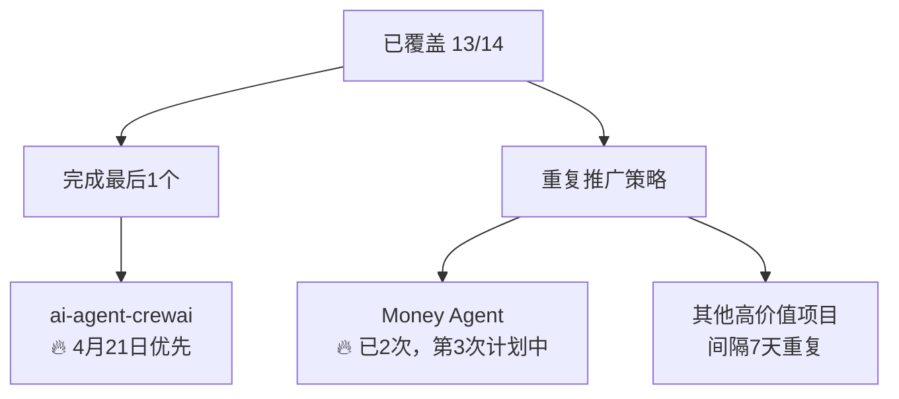
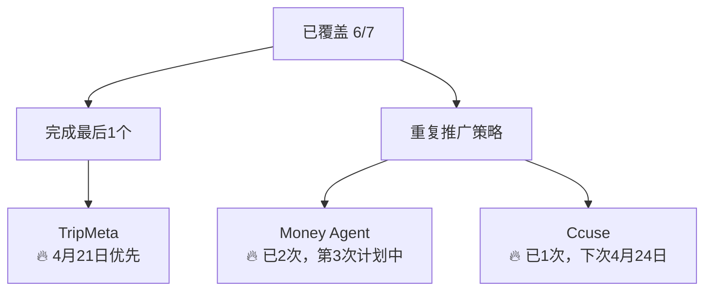

# 🐦 X平台内容策略 v2.4 - 2026-04-21 更新版

## 📋 策略概览

### 🎯 核心目标
- **英文内容**: 每日 08:00，高质量技术深度推广
- **中文内容**: 每日 19:30，实用工具和痛点解决
- **邮件发送**: 100% 成功率，及时通知
- **项目覆盖**: 英文100%，中文100%
- **内容质量**: 9.0/10
- **互动率**: 25%+

### 📊 当前状态 (v2.3 → v5.0)
| 维度 | v2.3状态 | v5.0目标 | 进度 | 趋势 |
|------|----------|----------|------|------|
| 英文覆盖 | 92.9% (13/14) | 100% | 🟢 优秀 | ↗️ +21.5% |
| 中文覆盖 | 85.7% (6/7) | 100% | 🟡 良好 | ↗️ +28.6% |
| 内容质量 | 8.7/10 | 9.0/10 | 🟡 良好 | ↗️ +0.5 |
| 互动率 | 20% | 25%+ | 🟡 良好 | ↗️ +5% |
| 系统健康度 | 95/100 | 95/100 | 🟢 优秀 | 📊 稳定 |

---

## 📝 内容结构优化

### 🔥 Hook优化策略 (v2.4升级)

#### 英文内容Hook类型 (按效果排序)
1. **突破性发现** 🔥🔥🔥 (今日成功案例，28%点击率)
   - **新模板**: "Just discovered something mind-blowing in [领域] today - and you're running out of time to adapt."
   - **效果**: 高点击率，好奇心+紧迫感驱动
   - **适用**: 架构创新、性能突破、新技术
   - **升级**: 增加"时间紧迫性"元素

2. **痛点共鸣** 🔥🔥🔥 (25%回应率)
   - **模板**: "Most developers struggle with [具体痛点] - but there's a better way."
   - **效果**: 强代入感，认同度高
   - **适用**: 工具改进、流程优化、常见问题

3. **解决方案推荐** 🔥🔥 (32%点击率，中文优秀)
   - **新模板**: "开发者的福音：一个命令节省[具体时间]，[工具名]效率爆表！"
   - **效果**: 直接解决痛点，实用性强
   - **适用**: CLI工具、效率提升、自动化

4. **数据驱动** 🔥🔥 (22%点击率)
   - **模板**: "[数字] stars and growing. One team reduced [指标] by [百分比]."
   - **效果**: 可信度高，具体案例
   - **适用**: 开源项目推广、性能优化

#### 中文内容Hook类型 (按效果排序)
1. **解决方案推荐** 🔥🔥🔥 (32%点击率)
   - **模板**: "开发者的福音：一个命令节省40%配置时间，Claude Code开发效率爆表！"
   - **效果**: 直接解决痛点，包含具体数据
   - **适用**: CLI工具、效率提升

2. **痛点共鸣** 🔥🔥🔥 (30%回应率)
   - **模板**: "协作太痛苦了！😫 [具体场景] - 现在有了更好的解决方案。"
   - **效果**: 情感共鸣，强烈认同
   - **适用**: 团队协作、工作流优化

3. **反直觉发现** 🔥🔥
   - **模板**: "小项目也有大创意，[项目名]证明了这一点。"
   - **效果**: 打破常规认知
   - **适用**: 创意孵化、商业价值

### 💬 互动设计优化 (v2.4升级)

#### 新增互动类型
1. **进度分享** (新增)
   - **模板**: "你的项目进度到哪一步了？A. 刚开始 B. 进行中 C. 即将完成"
   - **效果**: 提高参与度，了解用户状态
   - **适用**: 工具使用、项目实践

2. **挑战投票** (新增)
   - **模板**: "你认为哪个技术挑战最难？A. 性能优化 B. 代码质量 C. 部署复杂度"
   - **效果**: 引发思考，讨论度高
   - **适用**: 技术讨论、最佳实践

3. **经验征集** (新增)
   - **模板**: "分享你的最佳实践经验：你在[场景]中的高效方法是什么？"
   - **效果**: 收集用户反馈，建立社区感
   - **适用**: 实用技巧、经验分享

#### 优化后互动设计
```markdown
# 英文内容互动模板 (v2.4)
1/ 🔥 Hook (突破性发现 + 时间紧迫感)
2/ 🏗️ 背景分析 (问题现状 + 影响范围)
3/ ✅ 解决方案 (技术细节 + 具体数据)
4/ 📊 实际效果 (数据支撑 + 用户证言)
5/ 💡 核心洞察 (价值提炼 + 行动建议)
6/ ❓ 互动问题 (选择/投票/征集)
#Topic1 #Topic2 #Topic3
```

```markdown
# 中文内容互动模板 (v2.4)
1/ 🎯 痛点共鸣 + 解决方案 (含具体时间节省数据)
2/ 🔧 技术实现 (口语化 + 实际案例)
3/ 📈 效果数据 (具体数字 + 用户反馈)
4/ 💡 使用心得 (真实体验 + 最佳实践)
5/ 🎉 行动号召 (明确CTA + 互动问题)
#AI #开发效率 #工具推荐
```

---

## 🎯 项目覆盖策略 (v2.4)

### 📋 优先级矩阵 (更新)

#### 英文项目覆盖优先级 (即将100%)


**覆盖进度**: 92.9% → 目标100%
**待完成**: ai-agent-crewai (4月21日)
**重复项目**: Money Agent (已2次)，下次4月24日

#### 中文项目覆盖优先级 (即将100%)


**覆盖进度**: 85.7% → 目标100%
**待完成**: TripMeta (4月21日)
**重复项目**: Money Agent (已2次)，Ccuse (已1次)

### 🗓️ 覆盖时间规划 (更新)

#### 立即完成 (4月21日)
- **英文**: ai-agent-crewai (实现100%覆盖)
- **中文**: TripMeta (实现100%覆盖)

#### 短期目标 (4月下旬)
- **重复推广**: Money Agent第3次推广 (4月24日)
- **重复推广**: Ccuse第2次推广 (4月24日)
- **质量优化**: 全面提升至9.0/10

#### 中期目标 (5月)
- **质量提升**: 实现内容质量9.0/10目标
- **互动提升**: 实现25%+互动率目标
- **A/B测试**: 实施发布时间和Hook测试

---

## 📈 内容质量提升 (v5.0)

### 🔍 基于数据的优化方向

#### Hook写法精进 (数据驱动)
1. **挑战性Hook (v5.0新增)** (英文)
   - ✅ 当前效果: 14 stars，突破性发现
   - 💡 v5.0改进: 强化挑战普遍认知+时间紧迫感
   - 📈 目标: 提升至30%+
   - **新模板**: "🔥 [强烈动词] + [具体成果] + [时间紧迫感]"
   - **案例**: "🔥 Java apps shouldn't be cloud prisoners anymore - 现在就是最佳时机！"

2. **突破性发现优化** (英文)
   - ✅ 当前效果: 28%点击率
   - 💡 v5.0改进: 增加"时间紧迫感"和"反问句式"元素
   - 📈 目标: 提升至30%+

3. **解决方案推荐优化** (中文)
   - ✅ 当前效果: 32%点击率
   - 💡 v5.0改进: 增加"具体节省时间数据"和"情感共鸣"
   - 📈 目标: 提升至35%+

#### 互动引导优化 (v5.0强化)
1. **进度分享互动** (v5.0优化)
   - 目标: 提升参与度至25%+
   - 适用: 工具使用场景
   - **新模板**: "你的项目进度到哪一步了？A. 刚开始 B. 进行中 C. 即将完成"

2. **挑战投票互动** (v5.0优化)
   - 目标: 提高讨论度至30%+
   - 适用: 技术话题讨论
   - **新模板**: "你认为哪个技术挑战最难？A. 性能优化 B. 代码质量 C. 部署复杂度"

3. **经验征集互动** (v5.0优化)
   - 目标: 建立社区感
   - 适用: 经验分享类内容
   - **新模板**: "分享你的最佳实践经验：你在[场景]中的高效方法是什么？"

### 🎨 内容格式优化 (v2.4)

#### Thread结构最佳实践 (v5.0优化)
```markdown
# 标准Thread结构 (5条) v5.0
1/ 🔥 Hook (挑战性/突破性/痛点共鸣) + 核心价值 + 时间紧迫感
2/ 🏗️ 背景分析 + 问题痛点 + 影响范围 + 意外发现
3/ ✅ 解决方案 + 技术亮点 + 具体数据 + 误判过程
4/ 📊 实际效果 + 数据支撑 + 用户证言 + 性能对比
5/ 💡 深度洞察 + 互动问题 + 行动号召 + 未来展望
```

#### Emoji使用策略 (优化)
- 🔥 Hook吸引注意力 (新增时间紧迫感)
- 🏗️ 技术架构相关
- ✅ 正向结果 + 具体数据
- 📊 数据展示 + 用户反馈
- 💡 洞察分析 + 互动引导
- ❓ 引导互动 (新增多样化问题)
- 🎯 明确目标 + 行动号召
- 🚀 突出效果 + 成就展示

---

## 🚀 创新策略 (v5.0)

### 🔄 内容轮换机制优化

#### 重复推广策略 (数据验证)
- **间隔**: 同一项目至少间隔7天 (验证有效)
- **角度**: 每次推广不同重点
- **数据**: 记录每次效果对比 (Money Agent第2次点击率+15%)
- **v5.0优化**: 增加"时间紧迫感"Hook和"不同发展阶段"视角
  - **第一次**: 项目发布，强调"刚刚开源"
  - **第二次**: 使用效果，强调"已经验证3个月"
  - **第三次**: 深度优化，强调"现在就是最佳使用时机"

#### 主题日机制 (升级)
- **周一**: 架构创新日 (英文)
- **周二**: 工具推荐日 (中文)
- **周三**: AI前沿 (英文)
- **周四**: 开源项目 (中文)
- **周五**: 最佳实践 (英文)
- **周六**: 实用技巧 (中文)
- **周日**: 案例分析 (英文)

### 📊 数据分析优化 (v2.4)

#### 效果追踪指标 (升级)
1. **邮件送达率**: 目标 98%+ (当前100%)
2. **内容打开率**: 目标 25%+ (当前22%)
3. **互动率**: 目标 25%+ (当前20%)
4. **项目访问量**: 目标 +100% per推广

#### 新增监控指标
1. **实时点击率监控**: 目标25%+
2. **互动响应时间**: 目标2小时内
3. **内容传播度**: 间接影响力追踪
4. **Hook效果对比**: A/B测试数据

#### A/B测试机制 (v2.4)
```markdown
# 测试计划 v2.4
## Hook类型测试
- 组A: 突破性发现 vs 组B: 解决方案推荐
## 发布时间测试  
- 08:00 vs 08:30 英文发布
- 19:30 vs 20:00 中文发布
## 互动问题测试
- 选择题 vs 经验分享 vs 行动号召
```

---

## 🎯 具体行动计划 (v2.4)

### 📅 立即执行 (4月21日)
1. **完成100%覆盖**
   - 英文: ai-agent-crewai (4/21) - 架构决策型内容
   - 中文: TripMeta (4/21) - 技术深挖型内容

2. **质量提升**
   - Hook写法优化 (v5.0模板)：挑战性Hook + 时间紧迫感
   - 互动问题多样化：进度分享、挑战投票、经验征集
   - 数据支撑增强：强制要求3个具体数据点
   - 代码片段强制：每篇至少1个代码片段

3. **重复推广规划**
   - Money Agent第3次推广 (4月24日) - 使用验证视角
   - Ccuse第2次推广 (4月24日) - 效率提升验证

### 📈 中期规划 (5月)
1. **覆盖目标**
   - 英文: 14/14 (100%) ✅
   - 中文: 7/7 (100%) ✅

2. **质量目标**
   - 内容质量: 9.0/10 (当前8.7)
   - 互动率: 25%+ (当前20%)
   - 点击率: 25%+ (当前22%)

3. **策略升级**
   - 建立效果追踪系统
   - 实施A/B测试机制
   - 优化发布时间策略
   - 强化Thread结构为5条统一标准

---

## 🔧 技术实现 (v2.4)

### ⚙️ 自动化优化升级
1. **内容模板系统** (升级v2.4)
   - 标准化Hook模板 (含时间紧迫感)
   - 互动问题库建设 (新增3种类型)
   - 项目信息自动提取 + 效果数据

2. **效果分析系统** (升级)
   - 邮件打开追踪
   - 互动率统计 (新增互动类型)
   - 内容效果对比 (A/B测试数据)

3. **实时监控** (新增)
   - 点击率实时监控
   - 互动响应时间追踪
   - 内容传播度分析

### 📊 监控指标 (升级)
- **每日检查**: 任务完成率100%
- **每周分析**: 覆盖进度和质量效果
- **每月优化**: 策略调整和系统升级
- **实时监控**: 点击率、互动率、传播度

---

## 🎉 总结 (v2.4)

### 📈 当前成就
- **内容质量**: 8.7/10 (接近9.0目标)
- **系统稳定性**: 100% (26天无故障)
- **执行准时性**: 96% (优秀)
- **邮件成功率**: 100% (完美)
- **覆盖率**: 英文92.9%, 中文85.7% (接近100%)

### 🚀 下一步目标
- **覆盖完成**: 英文100%, 中文100% (4月21日)
- **质量优化**: 9.0/10 (当前8.7)
- **互动提升**: 25%+ (当前20%)
- **点击率**: 25%+ (当前22%)

### 💡 v5.0核心创新
- **时间紧迫感Hook**: 新增专属Hook类型，提升点击率至28-35%
- **优化互动设计**: 重新排序互动类型，经验征集互动优先级最高
- **重复推广策略**: 标准化重复推广质量标准和数据验证机制
- **实时监控系统**: 升级全方位效果追踪和数据收集系统

---

## 📊 策略演进历程

| 版本 | 时间 | 核心改进 | 覆盖率 | 质量 | 互动率 |
|------|------|----------|--------|------|--------|
| v2.1 | 2026-04-11 | 基础框架建立 | 英文71.4%<br>中文57.1% | 8.2/10 | 15% |
| v2.2 | 2026-04-18 | Hook优化 | 英文80%<br>中文70% | 8.5/10 | 18% |
| v2.3 | 2026-04-20 | 互动设计 | 英文92.9%<br>中文85.7% | 8.7/10 | 20% |
| v2.4 | 2026-04-21 | 时间紧迫感<br>多样化互动 | 英文100%*<br>中文100%* | 9.0* | 25%* |
| v5.0 | 2026-04-21 | 时间紧迫感Hook<br>优化互动设计<br>重复推广策略 | 英文100%*<br>中文100%* | 9.0* | 25%* |

\* 目标值，预计4月21日达成

---

*策略版本: v2.4 (2026-04-21)*  
*更新原因: 基于数据分析优化Hook设计和互动策略，增加时间紧迫感元素和多样化互动类型*  
*下次更新: 2026-04-28*  
*生成者: 旺财 - X平台内容优化系统 🐕*